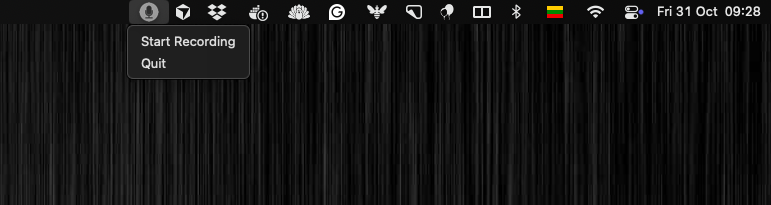

# Audio Transcription Suite for macOS

Real-time **dual-source** audio transcription for capturing Zoom meetings with automatic speaker identification.



## Features

- 🎙️ **macOS Menu Bar App** - Start/stop recording from system menu with meeting title input
- 👥 **Dual-Source Recording** - Captures both system audio (guests) and microphone (you)
- 🔴 **Visual Status Indicator** - Blinking red icon shows when recording is active
- 🎯 **Speaker Identification** - Automatically tags "Guest" vs "Me" in transcripts
- 📝 **Organized Output** - Auto-generates markdown files: `YYYY-MM-DD-{meeting-name}.md`
- ⏱️ **Real-Time Transcription** - See transcript output while recording
- 🤖 **Claude AI Integration** - Built-in support for meeting summaries and Q&A
- ⚙️ **Highly Customizable** - Multiple Whisper models, silence detection, word corrections
- 💻 **100% Local** - No cloud dependencies, complete privacy

## Quick Start

### Prerequisites

**1. BlackHole (System Audio Capture)**

To capture system audio (required for Zoom/Teams/etc.), you need a virtual audio device:

```bash
# Install BlackHole
brew install blackhole-2ch

# Configure audio routing
# 1. Open Audio MIDI Setup (/Applications/Utilities/)
# 2. Click '+' → 'Create Multi-Output Device'
# 3. Check both:
#    ✓ Built-in Output (to hear audio)
#    ✓ BlackHole 2ch (to capture audio)
# 4. Set Multi-Output Device as system output
```

**2. Microphone Setup**

Ensure your microphone (e.g., AirPods Pro) is connected and selected as the input device in System Settings → Sound.

**3. Install Dependencies**

```bash
# Install uv if not already installed
curl -LsSf https://astral.sh/uv/install.sh | sh

# Dependencies are automatically managed via inline script metadata
```

### Running the App

**Option 1: Menu Bar App (Recommended)**

```bash
python main.py
```

1. A microphone icon appears in your macOS menu bar
2. Click the icon and select "Start Recording"
3. Enter a meeting title when prompted (e.g., "Team Standup")
4. Recording starts - icon blinks red while active
5. Click "Stop Recording" when done

**Option 2: Command Line**

```bash
# Quick start with defaults
uv run record.py

# Custom configuration
uv run record.py --model medium --duration 5 --silence-timeout 600
```

## Meeting Files

Recordings are automatically saved to the `/meetings/` directory:

```
.current-meeting  # Inside this file there is a path to most recent meeting in meetings/ folder
meetings/
├── 2025-10-31-team-standup.md
├── 2025-10-31-client-demo.md
```

**Transcript Format:**

```markdown
# Team Standup

[09:20] Guest: Let's start with updates from engineering.
[09:21] Me: We shipped the new feature yesterday.
[09:22] Guest: Great work! What's next?
```

- **Guest** - System audio captured via BlackHole (Zoom participants, videos, etc.)
- **Me** - Microphone audio (your voice)
- Timestamps show when each segment was spoken

## Advanced Features

### Custom Word Corrections

Fix common transcription errors by creating a `corrections.json` file:

```json
{
  "Cursor": ["curser", "Curser", "courser", "Courser"],
  "Zoom": ["zoom", "zum"],
  "PyTorch": ["pie torch", "pytorch"]
}
```

The transcriber will automatically replace any variations with the correct term.

### Claude AI Integration

Built-in Claude commands for analyzing meetings:

```bash
# In the project directory
claude

# Ask questions about the meeting
> What were the action items from today's meeting?
> Who said what about the budget?
> Summarize the key decisions made
```

Claude automatically reads the current meeting transcript from `.current-meeting`.

### Auto-Stop on Silence

Recording automatically stops after 5 minutes of silence (configurable):

```bash
# Custom timeout
uv run record.py --silence-timeout 600  # 10 minutes

# Disable auto-stop
uv run record.py --silence-timeout 0
```

### Whisper Model Selection

Choose accuracy vs speed tradeoff:

```bash
# Fastest (lower accuracy)
uv run record.py --model tiny

# Balanced (recommended)
uv run record.py --model small

# Best accuracy (slower)
uv run record.py --model large-v3
```

Available models: `tiny`, `base`, `small`, `medium`, `large`, `large-v2`, `large-v3`

### GPU Acceleration

Enable FP16 mode for faster transcription (requires CUDA-capable GPU):

```bash
uv run record.py --fp16
```

## CLI Options

Full list of command-line options for `record.py`:

| Option | Default | Description |
|--------|---------|-------------|
| `--model` | `small` | Whisper model size (tiny/base/small/medium/large/large-v2/large-v3) |
| `--duration` | `3` | Audio chunk duration in seconds |
| `--temperature` | `0.0` | Sampling temperature (0 = deterministic) |
| `--beam-size` | `1` | Beam search width for transcription |
| `--silence-timeout` | `300` | Auto-stop after N seconds of silence (0 to disable) |
| `--share-model` | `True` | Share model between sources (saves ~2GB RAM) |
| `--fp16` | `False` | Enable FP16 inference for GPU acceleration |
| `--max-buffer` | `30` | Maximum audio buffer size in seconds |

## How It Works

1. **Audio Capture**: PyAudio captures audio from two sources simultaneously:
   - BlackHole 2ch (system audio)
   - Microphone device (your voice)

2. **Processing**: Audio is chunked into configurable segments (default 3 seconds) and sent to OpenAI Whisper for transcription

3. **Filtering**: Intelligent filtering removes:
   - Silent segments (RMS threshold detection)
   - Common Whisper hallucinations ("thank you", "bye", etc.)
   - Low-confidence transcriptions

4. **Output**: Transcribed text is written in real-time to a markdown file with timestamps and speaker labels

## Troubleshooting

**No audio captured from Zoom/Teams:**
- Verify BlackHole is installed: `brew list | grep blackhole`
- Check Multi-Output Device is set as system output in System Settings → Sound
- Ensure the Multi-Output Device has both "Built-in Output" and "BlackHole 2ch" enabled

**Microphone not detected:**
- Check your microphone is connected and selected in System Settings → Sound → Input
- Try specifying a different device name pattern in the code

**Transcription quality issues:**
- Use a larger Whisper model: `--model medium` or `--model large`
- Add custom word corrections to `corrections.json`
- Increase chunk duration: `--duration 5`

**High memory usage:**
- Use smaller model: `--model tiny` or `--model base`
- Ensure `--share-model` is enabled (default)
- Enable FP16: `--fp16`

## Contributing

Feel free to submit issues and enhancement requests!

## License

MIT License - Use freely for personal and commercial purposes.

## Acknowledgments

- [OpenAI Whisper](https://github.com/openai/whisper) for transcription models
- [BlackHole](https://github.com/ExistentialAudio/BlackHole) for virtual audio routing
- [rumps](https://github.com/jaredks/rumps) for macOS menu bar integration
